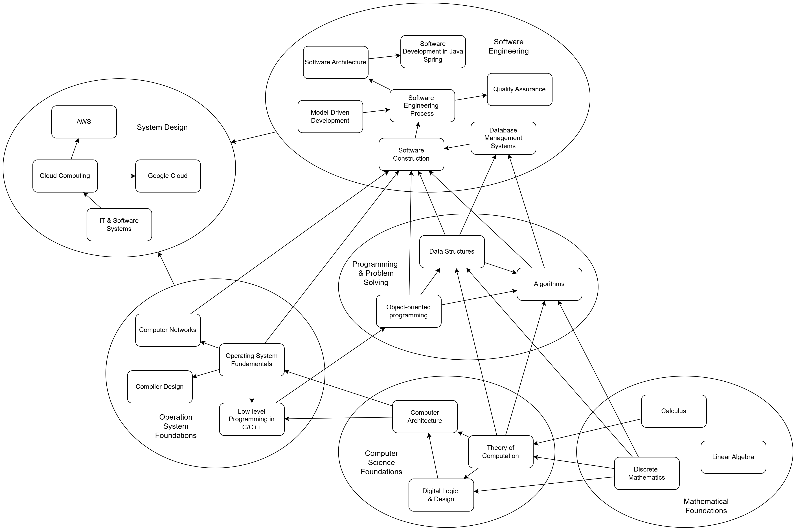

# Self-Taught Software Engineer

Having a bachelor's degree in Mechanical Engineering and then transitioning to Software Engineering required me to undertake extensive research and self-study in computer science foundations such as theory of computation, data structures and algorithms, and so on, as well as fundamental discrete mathematics such as logic theory, proof methods, set theory, graph theory, counting, probability, and so on. 

Many software engineering professionals who have completed their undergraduate studies in computer science may overlook these fundamentals and instead focus more on industry standards, specifications, and practices for software development. While these industry standards and practices are crucial in modeling, designing, and implementing critical software systems, I also believe that a strong understanding of computer science basics is equally essential. Not only does it provide the necessary skills for problem-solving, but it also cultivates a deeper thought process.

As such, I continue to self-educate and expand my knowledge of computer science fundamentals. The following map illustrates my journey:

*Self-Study Roadmap*